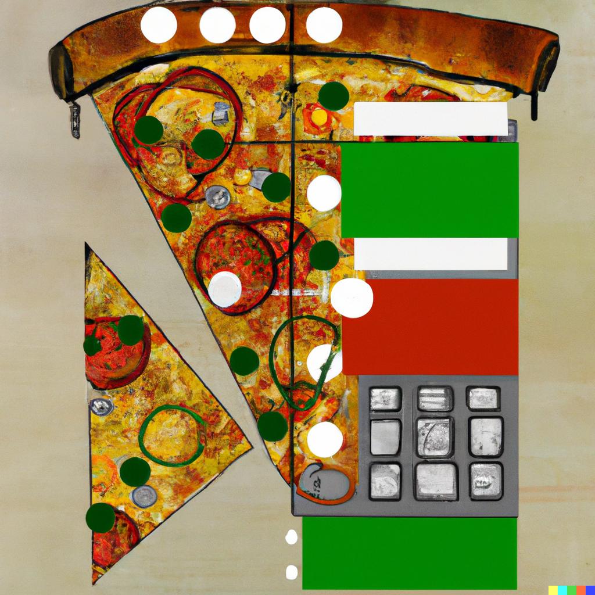

# ddpizza - Domain Driven Pizzeria 

A sandbox project for learning about DDD principles in python.
A lot of it is based on this book: [Architecture Patterns with Python by Harry Percival & Bob Gregory](https://www.cosmicpython.com/).
At least as a starting point. I'll add other references when I come to it. There is also a useful [github repo that they provided](https://github.com/cosmicpython/code) as a material for the book, you can check that out. 

---

----

 

---

## Requirements

- Python 3.10